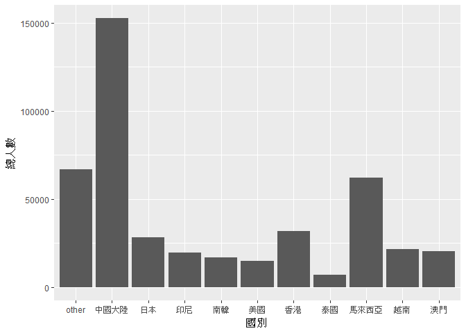
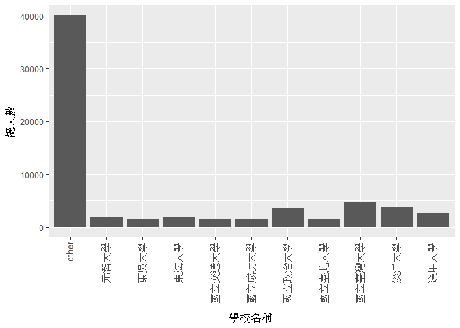

106-2 大數據分析方法 作業二
================
呂紹豪 化材四 B0323030

作業完整說明[連結](https://docs.google.com/document/d/1aLGSsGXhgOVgwzSg9JdaNz2qGPQJSoupDAQownkGf_I/edit?usp=sharing)

學習再也不限定在自己出生的國家，台灣每年有許多學生選擇就讀國外的大專院校，同時也有人多國外的學生來台灣就讀，透過分析[大專校院境外學生人數統計](https://data.gov.tw/dataset/6289)、[大專校院本國學生出國進修交流數](https://data.gov.tw/dataset/24730)、[世界各主要國家之我國留學生人數統計表](https://ws.moe.edu.tw/Download.ashx?u=C099358C81D4876CC7586B178A6BD6D5062C39FB76BDE7EC7685C1A3C0846BCDD2B4F4C2FE907C3E7E96F97D24487065577A728C59D4D9A4ECDFF432EA5A114C8B01E4AFECC637696DE4DAECA03BB417&n=4E402A02CE6F0B6C1B3C7E89FDA1FAD0B5DDFA6F3DA74E2DA06AE927F09433CFBC07A1910C169A1845D8EB78BD7D60D7414F74617F2A6B71DC86D17C9DA3781394EF5794EEA7363C&icon=..csv)可以了解103年以後各大專院校國際交流的情形。請同學分析以下議題，並以視覺化的方式呈現分析結果，呈現103年以後大專院校國際交流的情形。

來台境外生分析
--------------

### 資料匯入與處理

``` r
library(readr)
```

    ## Warning: package 'readr' was built under R version 3.4.4

``` r
library(dplyr)
```

    ## 
    ## Attaching package: 'dplyr'

    ## The following objects are masked from 'package:stats':
    ## 
    ##     filter, lag

    ## The following objects are masked from 'package:base':
    ## 
    ##     intersect, setdiff, setequal, union

``` r
library(tidyr)
```

    ## Warning: package 'tidyr' was built under R version 3.4.4

``` r
library(bindrcpp)
```

    ## Warning: package 'bindrcpp' was built under R version 3.4.4

``` r
library(knitr)
```

    ## Warning: package 'knitr' was built under R version 3.4.4

``` r
C103<-read_csv("http://stats.moe.gov.tw/files/detail/103/103_ab103_C.csv")
```

    ## Parsed with column specification:
    ## cols(
    ##   洲別 = col_character(),
    ##   國別 = col_character(),
    ##   `學位生-正式修讀學位外國生` = col_integer(),
    ##   `學位生-僑生(含港澳)` = col_integer(),
    ##   `學位生-正式修讀學位陸生` = col_integer(),
    ##   `非學位生-外國交換生` = col_integer(),
    ##   `非學位生-外國短期研習及個人選讀` = col_integer(),
    ##   `非學位生-大專附設華語文中心學生` = col_integer(),
    ##   `非學位生-大陸研修生` = col_integer(),
    ##   `非學位生-海青班` = col_integer(),
    ##   境外專班 = col_integer()
    ## )

``` r
S103<-read_csv("http://stats.moe.gov.tw/files/detail/103/103_ab103_S.csv")
```

    ## Parsed with column specification:
    ## cols(
    ##   學校類型 = col_character(),
    ##   學校代碼 = col_character(),
    ##   學校名稱 = col_character(),
    ##   `學位生-正式修讀學位外國生` = col_integer(),
    ##   `學位生-僑生(含港澳)` = col_integer(),
    ##   `學位生-正式修讀學位陸生` = col_integer(),
    ##   `非學位生-外國交換生` = col_integer(),
    ##   `非學位生-外國短期研習及個人選讀` = col_integer(),
    ##   `非學位生-大專附設華語文中心學生` = col_integer(),
    ##   `非學位生-大陸研修生` = col_character(),
    ##   `非學位生-海青班` = col_integer(),
    ##   境外專班 = col_integer()
    ## )

``` r
C104<-read_csv("http://stats.moe.gov.tw/files/detail/104/104_ab104_C.csv")
```

    ## Parsed with column specification:
    ## cols(
    ##   洲別 = col_character(),
    ##   國別 = col_character(),
    ##   `學位生-正式修讀學位外國生` = col_integer(),
    ##   `學位生-僑生(含港澳)` = col_integer(),
    ##   `學位生-正式修讀學位陸生` = col_integer(),
    ##   `非學位生-外國交換生` = col_integer(),
    ##   `非學位生-外國短期研習及個人選讀` = col_integer(),
    ##   `非學位生-大專附設華語文中心學生` = col_integer(),
    ##   `非學位生-大陸研修生` = col_integer(),
    ##   `非學位生-海青班` = col_integer(),
    ##   境外專班 = col_integer()
    ## )

``` r
S104<-read_csv("http://stats.moe.gov.tw/files/detail/104/104_ab104_S.csv")
```

    ## Parsed with column specification:
    ## cols(
    ##   學校類型 = col_character(),
    ##   學校代碼 = col_character(),
    ##   學校名稱 = col_character(),
    ##   `學位生-正式修讀學位外國生` = col_integer(),
    ##   `學位生-僑生(含港澳)` = col_integer(),
    ##   `學位生-正式修讀學位陸生` = col_integer(),
    ##   `非學位生-外國交換生` = col_integer(),
    ##   `非學位生-外國短期研習及個人選讀` = col_integer(),
    ##   `非學位生-大專附設華語文中心學生` = col_integer(),
    ##   `非學位生-大陸研修生` = col_character(),
    ##   `非學位生-海青班` = col_integer(),
    ##   境外專班 = col_integer()
    ## )

``` r
C105<-read_csv("http://stats.moe.gov.tw/files/detail/105/105_ab105_C.csv")
```

    ## Parsed with column specification:
    ## cols(
    ##   洲別 = col_character(),
    ##   國別 = col_character(),
    ##   學位生_正式修讀學位外國生 = col_integer(),
    ##   `學位生_僑生(含港澳)` = col_integer(),
    ##   學位生_正式修讀學位陸生 = col_integer(),
    ##   非學位生_外國交換生 = col_integer(),
    ##   非學位生_外國短期研習及個人選讀 = col_integer(),
    ##   非學位生_大專附設華語文中心學生 = col_integer(),
    ##   非學位生_大陸研修生 = col_integer(),
    ##   非學位生_海青班 = col_integer(),
    ##   境外專班 = col_integer()
    ## )

``` r
S105<-read_csv("http://stats.moe.gov.tw/files/detail/105/105_ab105_S.csv")
```

    ## Parsed with column specification:
    ## cols(
    ##   學校類型 = col_character(),
    ##   學校代碼 = col_character(),
    ##   學校名稱 = col_character(),
    ##   學位生_正式修讀學位外國生 = col_integer(),
    ##   `學位生_僑生(含港澳)` = col_integer(),
    ##   學位生_正式修讀學位陸生 = col_integer(),
    ##   非學位生_外國交換生 = col_integer(),
    ##   非學位生_外國短期研習及個人選讀 = col_integer(),
    ##   非學位生_大專附設華語文中心學生 = col_integer(),
    ##   非學位生_大陸研修生 = col_integer(),
    ##   非學位生_海青班 = col_integer(),
    ##   境外專班 = col_integer()
    ## )

``` r
C106<-read_csv("http://stats.moe.gov.tw/files/detail/106/106_ab105_C.csv")
```

    ## Parsed with column specification:
    ## cols(
    ##   洲別 = col_character(),
    ##   國別 = col_character(),
    ##   學位生_正式修讀學位外國生 = col_integer(),
    ##   `學位生_僑生(含港澳)` = col_integer(),
    ##   學位生_正式修讀學位陸生 = col_integer(),
    ##   非學位生_外國交換生 = col_integer(),
    ##   非學位生_外國短期研習及個人選讀 = col_integer(),
    ##   非學位生_大專附設華語文中心學生 = col_integer(),
    ##   非學位生_大陸研修生 = col_integer(),
    ##   非學位生_海青班 = col_integer(),
    ##   境外專班 = col_integer()
    ## )

``` r
S106<-read_csv("http://stats.moe.gov.tw/files/detail/106/106_ab105_S.csv")
```

    ## Parsed with column specification:
    ## cols(
    ##   學校類型 = col_character(),
    ##   學校代碼 = col_character(),
    ##   學校名稱 = col_character(),
    ##   學位生_正式修讀學位外國生 = col_integer(),
    ##   `學位生_僑生(含港澳)` = col_integer(),
    ##   學位生_正式修讀學位陸生 = col_integer(),
    ##   非學位生_外國交換生 = col_integer(),
    ##   非學位生_外國短期研習及個人選讀 = col_integer(),
    ##   非學位生_大專附設華語文中心學生 = col_integer(),
    ##   非學位生_大陸研修生 = col_integer(),
    ##   非學位生_海青班 = col_integer(),
    ##   境外專班 = col_integer()
    ## )

### 哪些國家來台灣唸書的學生最多呢？

``` r
foreign<-full_join(C103[,-1],C104[,-1], by ="國別" )
foreign<-full_join(foreign,C105[,-1], by ="國別" )
foreign<-full_join(foreign,C106[,-1], by ="國別" )


foreign$total<-rowSums(foreign[,-1],na.rm = T)

arrange(foreign,desc(total))%>%select("國別","total")%>%head(10)%>%kable()
```

| 國別     |   total|
|:---------|-------:|
| 中國大陸 |  152524|
| 馬來西亞 |   62031|
| 香港     |   31940|
| 日本     |   28200|
| 越南     |   21670|
| 澳門     |   20302|
| 印尼     |   19620|
| 南韓     |   16948|
| 美國     |   14846|
| 泰國     |    7035|

### 哪間大學的境外生最多呢？

``` r
foreignS<-full_join(S103[,c(-1,-2)],S104[,c(-1,-2)], by ="學校名稱" )
foreignS<-full_join(foreignS,S105[,c(-1,-2)], by ="學校名稱" )
foreignS<-full_join(foreignS,S106[,c(-1,-2)], by ="學校名稱" )

foreignS$`非學位生-大陸研修生.x`<-
  gsub("…","0",foreignS$`非學位生-大陸研修生.x`)%>%as.numeric()

foreignS$`非學位生-大陸研修生.y`<-
  gsub("…","0",foreignS$`非學位生-大陸研修生.y`)%>%as.numeric()


foreignS$total<-rowSums(foreignS[,-1],na.rm = T)

arrange(foreignS,desc(total))%>%select("學校名稱","total")%>%head(10)%>%kable()
```

| 學校名稱         |  total|
|:-----------------|------:|
| 無法區分校別     |  92586|
| 國立臺灣師範大學 |  22113|
| 國立臺灣大學     |  18199|
| 中國文化大學     |  16074|
| 銘傳大學         |  16057|
| 淡江大學         |  13887|
| 國立政治大學     |  11626|
| 國立成功大學     |  10982|
| 輔仁大學         |   9499|
| 逢甲大學         |   9474|

### 各個國家來台灣唸書的學生人數條狀圖

``` r
library(ggplot2) 
```

    ## Warning: package 'ggplot2' was built under R version 3.4.4

``` r
foreign10<-arrange(foreign,desc(total))%>%select("國別","total")

foreign10<-rbind(
  top_n(foreign10,10),
      slice(foreign10,11:n()) %>% summarise(國別="other",total=sum(total))
)
```

    ## Selecting by total

``` r
foreign10
```

    ## # A tibble: 11 x 2
    ##    國別       total
    ##    <chr>      <dbl>
    ##  1 中國大陸 152524.
    ##  2 馬來西亞  62031.
    ##  3 香港      31940.
    ##  4 日本      28200.
    ##  5 越南      21670.
    ##  6 澳門      20302.
    ##  7 印尼      19620.
    ##  8 南韓      16948.
    ##  9 美國      14846.
    ## 10 泰國       7035.
    ## 11 other     66881.

``` r
ggplot(foreign10, aes(x = 國別, y = 總人數))+
  geom_bar(aes(x=國別,y=total),stat = "identity") 
```



### 各個國家來台灣唸書的學生人數面量圖

``` r
#這是R Code Chunk
```

台灣學生國際交流分析
--------------------

### 資料匯入與處理

``` r
library(readxl)
```

    ## Warning: package 'readxl' was built under R version 3.4.4

``` r
exchange<-read_excel("C:/Users/user/Downloads/Student_RPT_07.xlsx") 
```

### 台灣大專院校的學生最喜歡去哪些國家進修交流呢？

``` r
group_by(exchange,`對方學校(機構)國別(地區)`)%>%
  summarise(total=sum(小計))%>%
  arrange(desc(total))%>%
  head(10)%>%kable()
```

| 對方學校(機構)國別(地區) |  total|
|:-------------------------|------:|
| 日本                     |  12430|
| 中國大陸                 |  10429|
| 美國                     |   8916|
| 大陸地區                 |   5996|
| 南韓                     |   2498|
| 法國                     |   2415|
| 大韓民國(南韓)           |   2131|
| 德國                     |   1706|
| 德意志聯邦共和國         |   1458|
| 英國                     |   1416|

### 哪間大學的出國交流學生數最多呢？

``` r
group_by(exchange,`學校名稱`)%>%
  summarise(total=sum(小計))%>%
  arrange(desc(total))%>%
  head(10)%>%kable()
```

| 學校名稱     |  total|
|:-------------|------:|
| 國立臺灣大學 |   4719|
| 淡江大學     |   3794|
| 國立政治大學 |   3479|
| 逢甲大學     |   2646|
| 東海大學     |   1881|
| 元智大學     |   1864|
| 國立交通大學 |   1513|
| 東吳大學     |   1457|
| 國立成功大學 |   1397|
| 國立臺北大學 |   1397|

### 台灣大專院校的學生最喜歡去哪些國家進修交流條狀圖

``` r
exchange10<-group_by(exchange,`學校名稱`)%>%
  summarise(total=sum(小計))%>%
  arrange(desc(total))

exchange10<-rbind(
  top_n(exchange10,10),
  slice(exchange10,11:n()) %>% summarise(`學校名稱`="other",total=sum(total))
)
```

    ## Selecting by total

``` r
exchange10
```

    ## # A tibble: 11 x 2
    ##    學校名稱      total
    ##    <chr>         <dbl>
    ##  1 國立臺灣大學  4719.
    ##  2 淡江大學      3794.
    ##  3 國立政治大學  3479.
    ##  4 逢甲大學      2646.
    ##  5 東海大學      1881.
    ##  6 元智大學      1864.
    ##  7 國立交通大學  1513.
    ##  8 東吳大學      1457.
    ##  9 國立成功大學  1397.
    ## 10 國立臺北大學  1397.
    ## 11 other        40092.

``` r
ggplot(exchange10, aes(x = 學校名稱 , y = 總人數))+
  geom_bar(aes(x=學校名稱,y=total),stat = "identity") +
  theme(axis.text.x = element_text(angle = 90, hjust = 1,vjust=0.3,size=10))
```



### 台灣大專院校的學生最喜歡去哪些國家進修交流面量圖

``` r
#這是R Code Chunk
```

台灣學生出國留學分析
--------------------

### 資料匯入與處理

``` r
overseas<-read_csv("C:/Users/user/Downloads/105年度世界各主要國家之我留學生人數統計表 .csv")
```

    ## Warning: Missing column names filled in: 'X4' [4], 'X5' [5], 'X6' [6]

    ## Parsed with column specification:
    ## cols(
    ##   洲別 = col_character(),
    ##   國別 = col_character(),
    ##   總人數 = col_number(),
    ##   X4 = col_character(),
    ##   X5 = col_character(),
    ##   X6 = col_character()
    ## )

### 台灣學生最喜歡去哪些國家留學呢？

``` r
overseas[,c(2:3)]%>%
  arrange(desc(總人數))%>%
  head(10)%>%kable()
```

| 國別     | 總人數 |
|:---------|:------:|
| 美國     |  21127 |
| 澳大利亞 |  13582 |
| 日本     |  8444  |
| 加拿大   |  4827  |
| 英國     |  3815  |
| 德國     |  1488  |
| 紐西蘭   |  1106  |
| 波蘭     |   561  |
| 馬來西亞 |   502  |
| 奧地利   |   419  |

### 台灣學生最喜歡去哪些國家留學面量圖

``` r
#這是R Code Chunk
```

綜合分析
--------

請問來台讀書與離台讀書的來源國與留學國趨勢是否相同(5分)？想來台灣唸書的境外生，他們的母國也有很多台籍生嗎？請圖文並茂說明你的觀察(10分)。
